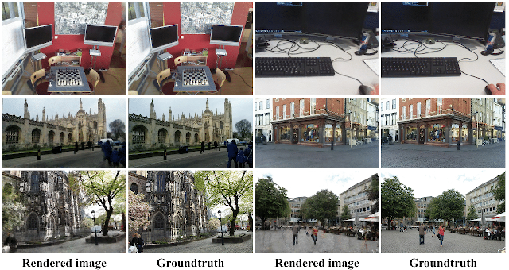
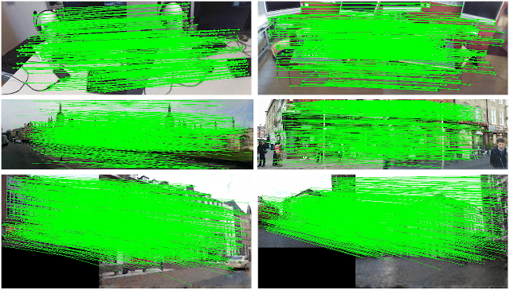
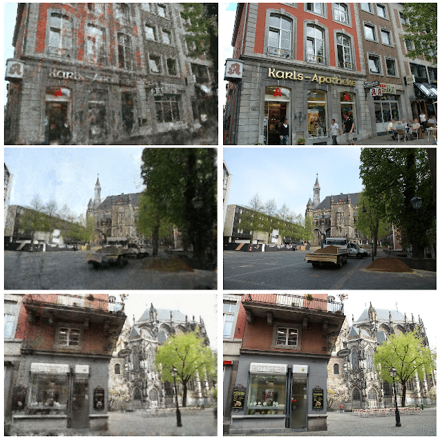

# VRS-NeRF: Visual Relocalization with Sparse Neural Radiance Field

The implementation of `VRS-NeRF: Visual Relocalization with Sparse Neural Radiance Field` which provides a a new
baseline of applying NeRFs to visual relocalization task. We use zip-nerf as implicit learning map (ILM) and 3D
reconstruction as explicit geometric map (EGM) for efficient localization. In the localization process, we use SFD2 as
local features, IMP as matcher, and online rendering of patches for matching. Results on 7Scenes and CambridgeLandmarks
are promising and much better than previous LENS and NeRF-loc. However, the pose accuracy on Aachen dataset is not
satisfying because of the poor quality of rendered
images.

## Results

### Rendered video
[](assets/vrs-nerf-comp.mp4)

### Groundtruth and rendered images



### Matching between query and rendered images



### 7Scenes dataset (patch size=15, median position (cm), rotation (deg) errors and average percentage of poses within error of 5cm, 5deg)

|          | chess  | fire    | heads  | office | pumpkin | kitchen | stairs  | Average (%) |
|:--------:|:------:|---------|:------:|:------:|:-------:|:-------:|:-------:|:-----------:|
|   LENS   | 3, 1.3 | 10, 3.7 | 7, 5.8 | 7, 1.9 | 8, 2.2  | 9, 2.2  | 14, 3.6 |      -      |
| NeRF-loc | 2, 1.1 | 2, 1.1  | 1, 1.9 | 2, 1.1 | 3, 1.3  | 3, 1.5  | 3, 1.3  |    89.5     |
|   ACE    | 2, 1.1 | 2, 1.8  | 2, 1.1 | 3, 1.4 | 3, 1.3  | 3, 1.3  | 3, 1.2  |    97.1     | 
|  SP+SG   | 0, 0.1 | 1, 0.2  | 0, 0.2 | 1, 0.2 | 1, 0.1  | 0, 0.1  | 2, 0.6  |    95.7     |
| SFD2+IMP | 0, 0.1 | 1, 0.2  | 0, 0.2 | 1, 0.2 | 1, 0.2  |  0, 0   | 2, 0.5  |    95.7     |
| VRS-NeRF | 0, 0.1 | 1, 0.2  | 0, 0.2 | 1, 0.2 | 1, 0.2  | 0, 0.1  | 3, 0.8  |    93.1     |

### CambridgeLandmarks (patch size=15, median position (cm), rotation (deg) errors and average percentage of poses within error of 25cm, 2deg)

|          | Kings College | Great Court | Old Hospital | Shop Facade | St Mary Church | Average (%) | 
|:--------:|:-------------:|:-----------:|:------------:|:-----------:|:--------------:|:-----------:|
|   LENS   |    33, 0.5    |      -      |   44, 0.9    |   27, 1.6   |    53, 1.6     |      -      |
| NeRF-loc |    7, 0.2     |   25, 0.1   |   18, 0.4    |   11, 0.2   |     4, 0.2     |      -      |
|   ACE    |    18, 0.4    |   42, 0.2   |   31, 0.6    |   5, 0.3    |    19, 0.6     |    54.68    |
|  SP+SG   |    7, 0.1     |   12, 0.1   |    9, 0.2    |   2, 0.1    |     4, 0.1     |    89.4     |
| SFD2+IMP |    7, 0.1     |   11, 0.1   |   10, 0.2    |   2, 0.1    |     4, 0.1     |    89.1     |
| VRS-NeRF |    9, 0.1     |      -      |   11, 0.2    |   2, 0.1    |     5, 0.2     |    89.3     |

### Aachen dataset (percentage of poses within error of 0.25m, 2deg / 0.5m, 5deg / 5m, 10deg)

|               |        Day         |        Night        |
|:-------------:|:------------------:|:-------------------:|
|     ESAC      | 42.6 / 59.6 / 75.5 |  3.1 / 9.2 / 11.2   |
|    HSCNet     | 71.1 / 81.9 / 91.7 | 32.7 / 43.9 / 65.3  |
|    SP+SPG     | 89.6 / 95.4 / 98.8 | 86.7 / 93.9 / 100.0 |
|   SFD2+IMP    | 89.7 / 96.5 / 98.9 | 84.7 / 94.9 / 100.0 |
| VRS-NeRF (15) | 60.8 / 67.8 / 73.1 | 19.4 / 22.4 / 25.5  |
| VRS-NeRF (31) | 70.1 / 76.9 / 80.9 | 44.9 / 51.0 / 62.2  |

### Imperfect rendering



### Code and pretrained models will come soon

## Citation

```
@inproceedings{sfd22023,
        title={{SFD2: Semantic-guided Feature Detection and Description}},
        author={Xue, Fei and Budvytis, Ignas and Cipolla, Roberto},
        booktitle={CVPR},
        year={2023}
}

@inproceedings{imp2023,
        title={IMP: Iterative Matching and Pose Estimation with Adaptive Pooling},
        author={Xue, Fei and Budvytis, Ignas and Cipolla, Roberto},
        booktitle={CVPR},
        year={2023}
}

@inproceedings{barron2023zipnerf,
      title={Zip-NeRF: Anti-Aliased Grid-Based Neural Radiance Fields}, 
      author={Jonathan T. Barron and Ben Mildenhall and Dor Verbin and Pratul P. Srinivasan and Peter Hedman},
       booktitle={ICCV},
       year={2023}
}
```